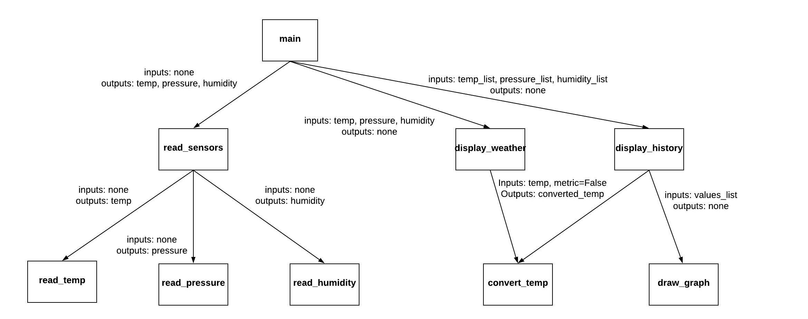

**Functions**

The function gives software the ability to organize and reuse software code.  Imagine you are in a car factory.  If you were the only one in the factory, it would take a very long time to build a single car.  However, if you have multiple people in the factory, the work could get done more efficiently.  One of the reasons we have efficiency is because we can organize the building of the car better with several hands to help.  However, if we put 1000 people in the car factory but didn't get them responsibilities, we would probably not be very sucessful.  The people in the factory are like functions in code.  The functions are added to organize the effort but each function must have a specific task to complete.  If we are wise, we will give tasks to each function that are commonly repeated in our software.  

Thinking of our favorite game again, you can think of common things which are done all the time which are likely written as their own functions:

- Update the location of the space ship
- Fire the photon torpedos
- Check to see if we have been hit
- Draw the planets, moons, and asteroids around us
- Calculate the health of our ship
- Save the state of our game so we can play again later

**Structure of a Python Function**

In Python, a function is defined using the `def` keyword.  A function has 4 components:

- Function Name
- Function Parameters
- Function Body
- Function Return

We can see all four parts in the example below which converts degrees in fahrenheit to degrees in celsius:

```python
def convert_temp(deg_f):
    deg_c = (deg_f - 32) * (5/9)
    return deg_c
```

The name of the function is `convert_temp`.  The function parameters is `deg_f`.  The function body is the code in the block after the `:`.  The function return is in the function body with the keyword `return` that provides the value of `deg_c` as a result.  

When you write a function, you have to think about the inputs it needs, the outputs it will provide, and how it will perform the task.  Inputs are listed in the function parameters.  It is possible that a function will not need any information because it will obtain all the information it needs from within the function.  If there are no parameters, then the parenethesis are still provided but are kept empty.  If there is more than one parameter, then commas are used to seperate the parameters.  Python provides the capability to indicate optional parameters.  An optional parameter means that it is optional for someone to provide a value.  Therefore, the function still needs to have a default value (indicated with an `=` sign in Python) to use in case the value is not provided.  The code below shows several examples of parameters:

```python
def say_hello():  # No Parameters
    pass

def add_numbers(number_list):  # One parameter ... a list
    pass

def calc_density(mass, volume):  # Two parameters ... two numbers
    pass

def draw_ship(x, y, force_field = False): # Three parameters
    pass                                  # The x and y are required
                                          # The force_field is optional.  If it
                                          # is not specified, then it will be 
                                          # assumed to be False
```

Outputs of a function are provided by a `return` statement.  If there is no output, then a function can omit a `return` statement.  A function can only return multiple outputs by using commas.  Here are some examples:

```python
def say_hello():
    print("Hello")
    # No outputs

def calc_density(mass, volume):
    density = mass / volume
    return density  # Return one output

def get_user():
    username = input("Username: ")
    password = input("Password: ")
    return username, password   # Return two outputs
```

A function does not run (or exeute) until it has been called.  When you call a function, you connect inputs and outputs to that function.  Be careful not to assume that parameter and variables in a function are the same as variables outside of the function just because their names are the same.  Python will map the variables together based on the order they are passed into the function.  Here is are some examples of calling functions:

```python
def calc_density(mass, volume):
    density = mass / volume
    return density  # Return one output

def get_user():
    username = input("Username: ")
    password = input("Password: ")
    return username, password   # Return two outputs

my_mass = float(input("Enter the mass:"))
my_volume = float(input("Enter the volume:"))

# Call the function and use the '=' sign to store the result
my_density = calc_density(my_mass, my_volume)

# Use a ',' to save all of the outputs. 
the_user, the_password = get_user()
```

**Organzing Functions**

In larger software, you will need several functions and they will likely need to call each other.  Before you write a bunch of functions, you should plan what functions you will need and how they will be called.  One way represent this is with a calling tree.  The following diagram is meant to represent a weather observation tool:



Notice that each line represents a function calling a function.  Traditionally, we call the first function `main`.  Each line shows the inputs and outputs.  With this information, we can write what is called stub code. Stub code includes all the parts of a function except the detailed implementation of the function body.  The goal with stub code is to obtain code that both matches your plan (i.e. your design) and code that also runs (doesn't do the weather stuff yet but it does run).  The next step after stub code is implementing each function one at a time.  Here is the stub code for the design above:

```python
def main():
    temp_list = []
    pressure_list = []
    humidity_list = []
    # These calls should be done when the user wants them
    # The lists above need to be updated when new sensor data is received
    temp, pressure, humidity = read_sensors()
    display_weather(temp, pressure, humidity)
    display_history(temp_list, pressure_list, humidity_list)

def read_sensors():
    temp = read_temp()
    pressure = read_pressure()
    humidity = read_humidity()
    return temp, pressure, humidity

def read_temp():
    # Read from actual sensor
    temp = 0
    return temp

def read_pressure():
    # Read from actual sensor
    pressure = 0
    return pressure

def read_humidity():
    # Read from actual sensor
    humidity = 0
    return humidity

def display_weather(temp, pressure, humidity):
    # Only do the conversion if needed
    converted_temp = convert_temp(temp, metric=True)

def display_history(temp_list, pressure_list, humidity_list):
    # Need to call convert_temp on all the temp's in the list if needed
    draw_graph(temp_list)
    draw_graph(pressure_list)
    draw_graph(humidity_list)

def convert_temp(temp, metric=False):
    # Do conversion calculation
    calc_temp = 0
    return calc_temp

def draw_graph(values_list):
    # Draw a graph
    pass

# Call the starting function
main()

```

In the stub code, there is still plenty of work to be done to fully implement the solution.  Notice that the `main()` function is called at the very bottom to start up our code.

**Example: Electronic Purchase**

When making a purchase, there are several things that must be determined:

- What is the tax?
- What is the shipping cost?
- Are there any coupons?

We will write a seperate function to handle of each of these questions.  The table below works out all of the inputs and outputs of each of these functions:

| Function      | Inputs                                            | Outputs        |
| ------------- | ------------------------------------------------- | -------------- |
| calc_tax      | subtotal, country_tax_rate, local_tax_rate        | total_tax      |
| calc_shipping | total_weight, distance, expedited (True or False) | total_shipping |
| calc_coupons  | subtotal, coupon_code                             | total_savings  |

Here is the implementation for these three functions:

```python
def calc_tax(subtotal, country_tax_rate, local_tax_rate):
    """
    Use the tax rates to determine the total tax.
    """
    country_tax = subtotal * country_tax_rate
    local_tax = subtotal * local_tax_rate
    total_tax = country_tax_rate + local_tax_rate
    return total_tax

def calc_shipping(total_weight, distance, expedited):
    """
    Minimum shipping cost is $5.
    For every pound over 20 pounds, there is a 25 cent per pound cost.
    If the distance is greater than 1000 miles, there is a 50% additional shipping charge
    For expedited shipping, there is a $20 extra charge.
    """
    shipping = 5
    if total_weight > 20:
        shipping += (total_weight - 20) * 0.25
    if distance > 1000:
        shipping *= 1.5
    if expedited:
        shipping += 20
    return shipping

def calc_coupons(subtotal, coupon_code):
    """
    CODE      RULES
    ------    -------------------
    SAVE50    50% if spending more than $20
    SAVE10    10% with no minimum spending
    """
    if coupon_code == "SAVE50":
        if subtotal >= 20:
            return subtotal * 0.5
        else:
            return 0
    elif coupon_code == "SAVE10":
        return subtotal * 0.1
    else:
        return 0
```

To call these functions, we will create a function called `calc_final_price` which will provide all the needed inputs of which `expedited` and `coupon_code` will be optional.  The decision to make these optional was because we envision that possibility that the user won't know about these things so we will provide some default values.  Some sample test cases are shown below as well.

```python
def calc_final_price(subtotal, country_tax_rate, local_tax_rate, 
                     total_weight, distance, expedited=False, 
                     coupon_code=""):
    tax = calc_tax(subtotal, country_tax_rate, local_tax_rate)
    shipping = calc_shipping(total_weight, distance, expedited)
    savings = calc_coupons(subtotal, coupon_code)
    return subtotal + tax + shipping - savings

price = calc_final_price(100, 0.06, 0.001, 30, 125, coupon_code="SAVE50")
print("${:.2f}".format(price))

price = calc_final_price(100, 0.06, 0.001, 30, 125, expedited=True)
print("${:.2f}".format(price))

price = calc_final_price(100, 0.06, 0.001, 30, 125)
print("${:.2f}".format(price))

price = calc_final_price(100, 0.06, 0.001, 30, 2000)
print("${:.2f}".format(price))
```

The result of running these tests is:

```
$57.56
$127.56
$107.56
$111.31
```

 **Problem to Solve: Robot**

A robot wants to move around on the following grid:


When the robot starts, the robot will be at position (5, 5) and have 100 units of fuel.  Create a seperate function to do each of the following:

- `move_up` - Change the coordinate position and reduce fuel by 5.  Display an error message if there is not enough fuel.
- `move_down` - Change the coordinate position and reduce fuel by 5.  Display an error message if there is not enough fuel.
- `move_left` - Change the coordinate position and reduce fuel by 5.  Display an error message if there is not enough fuel.
- `move_right` - Change the coordinate position and reduce fuel by 5.  Display an error message if there is not enough fuel.
- `fire_laser` - Reduce fuel by 10 and display "Pew Pew".  Display an error message if there is not enough fuel.

Notice that all of these described above must be done within the functions.  You do not need to worry about leaving the boundaries of the grid shown above.  You will also need to write code to prompt the user for a command to move or to fire the laser.  The appropriate funciton should be called based on the user choice.  Think about the inputs and outputs required for each function before writing the code.

An example execution of the program is shown below:

```
Robot at (5,5) with 100 units fuel
l)eft r)ight u)p d)own f)ire q)uit
> l

Robot at (4,5) with 95 units fuel
l)eft r)ight u)p d)own f)ire q)uit
> l

Robot at (3,5) with 90 units fuel
l)eft r)ight u)p d)own f)ire q)uit
> l

Robot at (2,5) with 85 units fuel
l)eft r)ight u)p d)own f)ire q)uit
> r

Robot at (3,5) with 80 units fuel
l)eft r)ight u)p d)own f)ire q)uit
> u

Robot at (3,6) with 75 units fuel
l)eft r)ight u)p d)own f)ire q)uit
> u

Robot at (3,7) with 70 units fuel
l)eft r)ight u)p d)own f)ire q)uit
> u

Robot at (3,8) with 65 units fuel
l)eft r)ight u)p d)own f)ire q)uit
> d

Robot at (3,7) with 60 units fuel
l)eft r)ight u)p d)own f)ire q)uit
> d

Robot at (3,6) with 55 units fuel
l)eft r)ight u)p d)own f)ire q)uit
> f
Pew Pew!

Robot at (3,6) with 45 units fuel
l)eft r)ight u)p d)own f)ire q)uit
> f
Pew Pew!

Robot at (3,6) with 35 units fuel
l)eft r)ight u)p d)own f)ire q)uit
> f
Pew Pew!

Robot at (3,6) with 25 units fuel
l)eft r)ight u)p d)own f)ire q)uit
> f
Pew Pew!

Robot at (3,6) with 15 units fuel
l)eft r)ight u)p d)own f)ire q)uit
> f
Pew Pew!

Robot at (3,6) with 5 units fuel
l)eft r)ight u)p d)own f)ire q)uit
> f
Not enough fuel!

Robot at (3,6) with 5 units fuel
l)eft r)ight u)p d)own f)ire q)uit
> u

Robot at (3,7) with 0 units fuel
l)eft r)ight u)p d)own f)ire q)uit
> u
Not enough fuel!

Robot at (3,7) with 0 units fuel
l)eft r)ight u)p d)own f)ire q)uit
> q
```

You can check your code with the solution here: [Solution](robot.py)

[Back to Welcome Page](0-welcome.md)